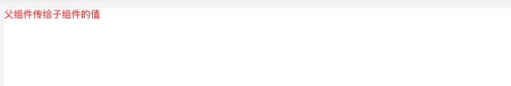
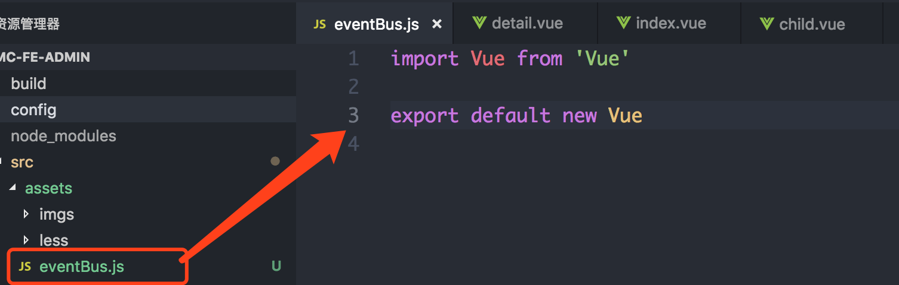
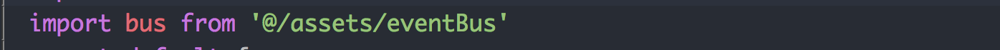
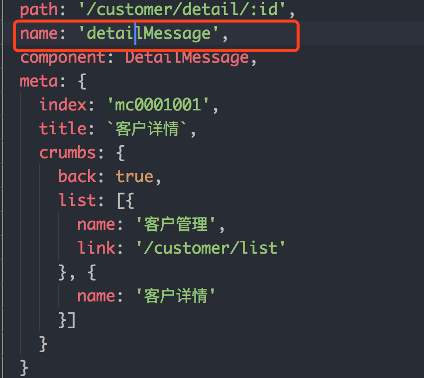
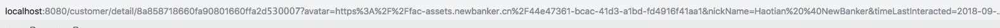
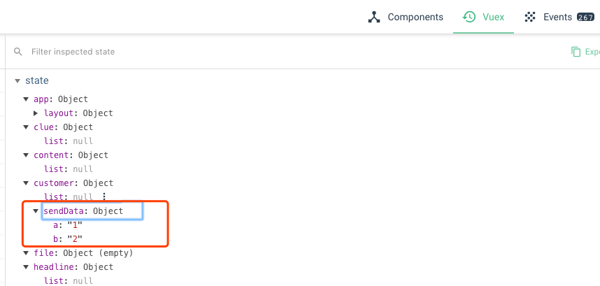

# Vue的组件通信
::: tip 前瞻
  前端在处理交互时，不管是在react或者Vue项目中，经常会遇到一个问题：组件之间如何通信。  
  该文档简单介绍了在Vue项目中，父子组件，兄弟组件如何通信。
:::

## 父组件向子组件传递数据
在Vue中，父组件可以通过`props`向子组件传值

父组件部分
```html
  <template>
    <child :toChildData="data"></child>
  </template>
```
在调用组件的时候，使用 `v-bind` 将 `toChildData` 的值绑定为 `App.vue` 中定义的变量 data
```javascript
  <script>
    import child from './child.vue'
    export default {
      name: 'father',
      data () {
        return {
          data: '父组件传给子组件的值'
        }
      },
      components: {
        child
      }
    }
  </script>
```

子组件部分
```html
  <template>
    <div>{{toChildData}}</div>
  </template>
```
这是`child.vue`的HTML结构，`toChildData`则是从props中获取到父组件传给子组件的值
```javascript
  <script>
    export default {
      name: 'child',
      props: {
        toChildData: {
          type: String,
          default: ''
        }
      }
    }
  </script>
```
一般我们在props中添加变量后，就无需在data中重复添加

效果如下：  

## 子组件向父组件传递数据
子组件主要通过`$emit`事件传递数据给父组件

子组件部分：  
这是子组件的HTML结构
```html
  <template>
    <div class="child">
      <label>
        name: <input type="text" v-model="name">
        <button @click="handleClick">点击</button>
      </label>
    </div>
  </template>
```
通过点击事件（handleClick）将输入的name传给父组件，在`handleClick中`使用`$emit`方法遍历了`getData`事件，并返回了`this.name`。  
`$emit`方法中第一个参数是在父组件定义的事件，第二个参数是传递给父组件的值
```javascript
  <script>
    export default {
      name: 'child',
      data () {
        return {
          name: ''
        }
      },
      methods: {
        handleClick () {
          this.$emit('getData', this.name)
        }
      }
    }
  </script>
```
父组件部分：  
`getData` 是我们自定义的事件，用来接收子组件传递的数据，也是`$emit`方法的第一个参数
```html
  <template>
    <div class="father">
      <child @getData='getChildData'></child>
      <div>name是：{{childData}}</div>
    </div>
  </template>
```
`getChildData` 中的参数 `mes` 就是从子组件传递过来的数据
```javascript
  <script>
    import child from './child.vue'
    export default {
      name: 'father',
      data () {
        return {
          childData: ''
        }
      },
      components: {
        child
      },
      methods: {
        getChildData (mes) {
          this.childData = mes
        }
      }
    }
  </script>
```
结果如下：

## 兄弟组件之间传递数据
### 通过bus传递
* 方案一    
首先要建立一个中转站：`eventBus.js` 建议放在`assets`文件夹下面，内容很简单，引入vue并且导出即可。

第二步，在需要触发事件的那个组件里面先引入`eventBus.js`。

最后一步就比较简单了，在你需要展示效果的另一个组件页面去监听它即可，监听要注意必须在生命周期函数`created`中。  
在监听页面也需要引入`eventBus.js`。  
组件1：
  ```javascript
    <template>
      <div class="father">
        <child @getData='getChildData'></child>
        <div>name是：{{childData}}</div>
        <button @click="handleBus">触发bus</button>
      </div>
    </template>

    <script>
      import child from './child.vue'
      import bus from '@/assets/eventBus'
      export default {
        name: 'father',
        data () {
          return {
            childData: ''
          }
        },
        components: {
          child
        },
        methods: {
          getChildData (mes) {
            this.childData = mes
          },
          // 该操作将数据传递给其他组件
          handleBus () {
            bus.$emit('getBusData', '通过bus传递数据')
          }
        }
      }
    </script>
  ```
  组件2：
  ```javascript
    <template>
      <div class="child">
        <label>
          name: <input type="text" v-model="name">
          <button @click="handleClick">点击</button>
        </label>
      </div>
    </template>

    <script>
      import bus from '@/assets/eventBus'
      export default {
        name: 'child',
        data () {
          return {
            name: ''
          }
        },
        created () {
          bus.$on('getBusData', (mes) => {
            this.$emit('getData', mes)
          })
        },
        // 最好在组件销毁前
        // 清除事件监听
        beforeDestroy () {
          bus.$off('getBusData');
        }
      }
  </script>
  ```
* 方案二：将bus定义到全局  
`vue-cli`搭建好项目之后，使用`nbnpm`安装`vue-bus`
  ```bash
  nbnpm install --save vue-bus
  ```
  在入口文件`main.js`中全局注册
  ```javascript
    import VueBus from 'vue-bus'
    Vue.use(VueBus)
  ```
  传递数据：
  ```javascript
    handleBus () {
      this.$bus.emit('getBusData', '通过bus传递数据')
    }
  ```
  接收数据：
  ```javascript
    created () {
      this.$bus.on('getBusData', (mes) => {
        this.$emit('getData', mes)
      })
    }
  ```
  最终效果：
  

### 通过vue-router传递
name 跟我们在路由中自定义的name相匹配，query里面的内容会转换为URL中的参数传递到其他组件
```javascript
  this.$router.push({
    name: 'detailMessage',
    query: {
      a: '1',
      b: '2',
      c: '3',
    }
  })
```
路由  
 

获取通过`vue-router`传递的值
 ```javascript
  let data = this.$route.query
 ```
url里的具体内容展示：

### 使用vuex状态管理
* 1，`state`: 用于数据的存储，是`store`中唯一数据源
```javascript
  // store.js
  const state = {
    sendData: {}
  }
```
* 2，`mutations`：类似函数，改变`state`数据的唯一途径，且不能用于**处理异步事件**
```javascript
  // store.js
  import {GET_MESSAGE_DATA} from '../mutation-types'
  const mutations = {
    [GET_MESSAGE_DATA] (state, data) {
      state.sendData = data
    }
  }
```
::: tip tips
  使用常量替代 `mutation` 事件类型在各种 `Flux` 实现中是很常见的模式。这样可以使 `linter` 之类的工具发挥作用，同时把这些常量放在单独的文件中可以让你的代码合作者对整个 app 包含的 `mutation` 一目了然：
:::
```javascript
  // mutation-types.js
  export const GET_MESSAGE_DATA = 'GET_MESSAGE_DATA'
```
组件1：
```javascript
  this.$store.commit('GET_MESSAGE_DATA', {a: '1', b: '2'})
```
组件2获取组件1传递的值：
```javascript
  // 第一步
  import { mapState } from 'vuex'
  // 第二步
  computed: {
    ...mapState({
      data: state => state.customer.sendData
    })
  },
  // 第三不，在组件中的使用
  console.log(this.data)
```
::: tip tips
  在vuex中有很多获取state的值有很多方法，我只是用了其中一种，具体使用方法请[移步](https://www.jianshu.com/p/b3be6db8a1d4)
:::
我们也可以通过谷歌`Vue扩展程序`来查看state的变化

::: danger 提示
由于vue自身特性的原因，`vuex`中的数据在页面刷新之后其中的数据会初始化，这就导致组件之间通过`vuex`传递的数据在用户f5刷新页面之后会丢失，解决办法[*详见*](https://www.jianshu.com/p/3ce5f84c92d3)
:::
